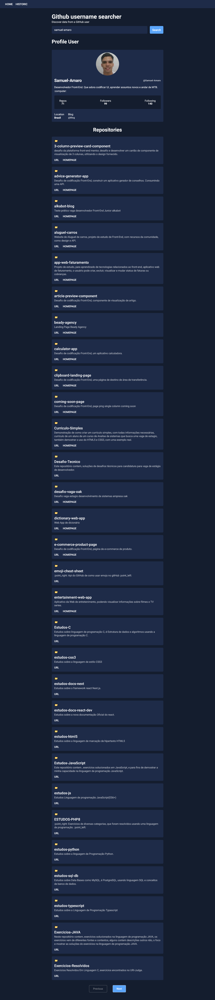
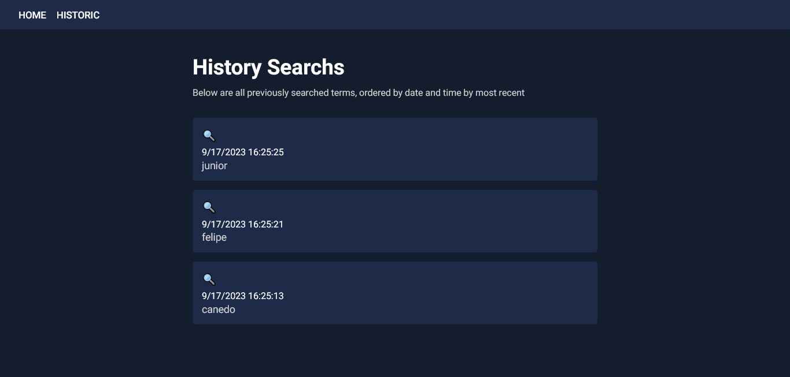

# Challenge Niuco

Frontend Assigment: pesquisador de nome de usuário do Github

## Descrição Projeto

Para esta tarefa, você deve consumir a API REST pública do Github para apresentar os dados do github de um determinado usuário.

O aplicativo da web deve ter duas páginas/rotas:

- Página de pesquisa : o usuário digita um nome de usuário do Github em um formulário. Depois que o formulário é enviado, os dados são buscados e apresentados na IU. Você pode mostrar o que quiser, embora seja necessário mostrar os metadados do perfil do usuário (exemplo: foto do avatar, nome, e-mail, biografia, etc.) e as informações de metadados de seus repositórios (exemplo: nome, descrição, URL, etc. )
- Página de histórico : a página deve mostrar todos os termos pesquisados ​​anteriormente pelo usuário, ordenados por timestamp. Os mais recentes devem estar no topo. O usuário deve poder clicar no item do histórico e pesquisar novamente utilizando o termo pesquisado.

## Visão Geral




## Links

- [Reposítorio Projeto](https://github.com/Samuel-Amaro/teste-niuco)
- [Resultado Projeto](https://teste-niuco.vercel.app/)

## Construido Com

- HTML5
- CSS3(Flex-Box, Grid, Mobile-First workflow, Responsive Web Design, CSS Modules, Normalize)
- Typescript
- Web Acessibility(a11y)
- Next.js App Router
- React(Context API, Hooks)
- NPM

## Getting Started

First, run the development server:

```bash
npm run dev
# or
yarn dev
# or
pnpm dev
```
